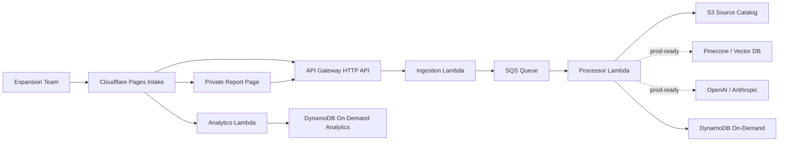

# GrantStack

AI grant intelligence for companies planning capex-heavy facility expansions.

GrantStack turns a rough expansion plan into a cited first-pass incentive strategy: which grant, tax credit, workforce, infrastructure, and economic-development programs are worth pursuing, what risks could kill eligibility, and what the team should validate next.

**Live demo:** https://grantstack.pages.dev<br>
**Repository:** https://github.com/manynames3/grantstack<br>
**Backend API:** https://rx967db2q9.execute-api.us-east-1.amazonaws.com/projects<br>
**Sample report:** https://grantstack.pages.dev/report?sample=true

## The Problem

Manufacturers, logistics operators, energy companies, and other capex-heavy businesses often make site and expansion decisions before they have a clear read on public funding.

The early process is messy:

- Project specs live in emails, spreadsheets, PDFs, and consultant notes.
- Incentive programs vary by state, locality, job count, wages, capex, industry, and timeline.
- Teams waste time chasing programs that are not a fit.
- CFOs and operators need a defensible first-pass answer before paying for deeper advisory work.
- Generic AI tools can summarize programs, but they do not create a structured, source-backed workflow with status, auditability, retries, and private report links.

GrantStack is built for that gap: fast enough for early diligence, structured enough for buyer conversations, and architected like a real serverless product instead of a one-off prompt wrapper.

## Who It Is For

Primary end users:

- Expansion teams evaluating new sites or facility upgrades.
- CFO, finance, and strategy teams screening whether incentives are worth deeper pursuit.
- Site-selection consultants and economic-development advisors preparing first-pass memos.
- Operators who need to turn project basics into a better conversation with public agencies.

Best first customer niche:

- US manufacturing or advanced industrial companies considering a multi-million-dollar expansion with meaningful job creation and a site decision inside 3-6 months.

## What It Does

A user submits:

- Location
- Capital investment
- New jobs
- Facility type
- Optional buyer context such as company, wages, timeline, and competing locations

GrantStack returns a private report with:

- Eligibility score and confidence level
- Recommended incentive program categories
- Cited program recommendations with source URLs
- Strengths tied to capex, jobs, location, and facility type
- Risk flags and missing diligence items
- Next actions for internal review or agency outreach
- Validation disclaimer so the report is positioned as decision support, not legal or tax advice

## Live Workflow

The deployed demo is an end-to-end product flow:

1. User submits project specs on the Cloudflare Pages frontend.
2. API Gateway accepts the request and returns `202 Accepted` immediately with a private report token.
3. Ingestion Lambda validates the payload, writes the accepted record, and queues the job.
4. SQS triggers an asynchronous processor worker.
5. Processor Lambda screens the project against the active source catalog and optional LLM/vector provider path.
6. DynamoDB stores the completed structured report.
7. The report page polls the private tokenized endpoint and renders the result.
8. First-party analytics events are posted to `/analytics` for page views, CTA clicks, sample-report views, submission outcomes, and report actions.



## Why This Is Not Just A Prompt Demo

GrantStack is intentionally built as a production-style event-driven system:

- **Near-zero idle cost:** API Gateway HTTP API, Lambda, SQS, DynamoDB On-Demand, S3, and Cloudflare Pages.
- **Async architecture:** ingestion returns immediately while heavier report generation runs through SQS.
- **Failure isolation:** DLQ, retry semantics, partial batch failure handling, and replay runbook.
- **Private report access:** generated report links use per-project access tokens.
- **Source-backed output:** recommendations include source URLs and diligence questions.
- **Jurisdiction-specific rules:** retrieved programs are checked against explicit first-pass eligibility rules so missing facts and threshold failures are visible.
- **Refresh pipeline:** scheduled source refresh Lambda verifies official URLs and stores catalog metadata in S3.
- **Environment split:** separate Terraform backend configs and tfvars examples for dev, staging, and prod.
- **Observability:** X-Ray tracing, API access logs, CloudWatch dashboard, alarms, and log metric filters.
- **Basic product analytics:** first-party event capture for activation and report-action signals without cookies or an always-on service.
- **Provider-ready AI path:** deterministic dev mode plus a larger multi-state source corpus, OpenAI-compatible embeddings, Pinecone Serverless retrieval, and OpenAI/Anthropic hooks for staging/prod.
- **CI:** GitHub Actions validates Terraform and Python handlers on every push.

## Architecture Highlights

Backend:

- Amazon API Gateway HTTP API
- AWS Lambda for ingestion, processing, reporting, analytics, and source refresh
- Amazon SQS with DLQ
- Amazon DynamoDB `PAY_PER_REQUEST`
- Amazon S3 for active source catalog and Terraform remote state
- EventBridge scheduled source refresh
- CloudWatch Logs, alarms, dashboard, and X-Ray tracing
- Terraform-managed least-privilege IAM

Frontend:

- Static Cloudflare Pages site
- Product landing page, sample report path, intake form, report page, privacy, and terms
- No always-on application server

AI/retrieval modes:

- Dev: deterministic source-backed evidence engine for predictable cost.
- Staging/prod: configurable LLM and vector path using Secrets Manager ARNs, OpenAI-compatible embeddings, Pinecone Serverless, OpenAI, Anthropic, or generic JSON providers.
- Corpus: curated state/federal incentive sources currently cover GA, NC, SC, TN, TX, OH, IN, AL, KY, and federal EDA programs, with explicit eligibility-rule checks attached to supported programs.

## Current Product Readiness

GrantStack is ready for credible paid-pilot conversations, not enterprise procurement.

What is live:

- Public landing page
- Project intake
- Sample/demo report path
- API Gateway/Lambda/SQS/DynamoDB backend
- Private tokenized report endpoint
- Cited incentive-screening report generation
- First-party activation analytics
- Source refresh job
- CloudWatch/X-Ray operations baseline
- Terraform IaC with remote backend support
- CI workflow
- Advisory disclaimers and a human-review workflow boundary for paid use

Known limits:

- The deployed dev environment uses `mock_external_calls = true`, so reports use the deterministic source-backed engine rather than paid external LLM/vector calls.
- The source catalog is expanded for an industrial pilot, but it is not a national incentive database and should not be sold as exhaustive coverage.
- Authentication, billing, saved customer workspaces, and email delivery are not implemented yet.
- Reports are first-pass decision-support memos and still require human validation before being used for legal, tax, accounting, or public-agency commitments.

## What A Reviewer Should Notice

This repo is designed to show practical full-stack cloud engineering judgment:

- Serverless architecture that scales to zero instead of relying on idle workers.
- Terraform modules that manage real AWS resources, IAM, observability, backend state, and environment separation.
- Python Lambda handlers with validation, idempotent processing, timeout-safe external-call structure, and clear failure handling.
- A working buyer-facing frontend connected to a live backend.
- CI and runbooks that make the project maintainable after the first demo.
- Honest product boundaries instead of pretending the prototype is already an enterprise SaaS.

## Live Surfaces

- Landing page: https://grantstack.pages.dev
- Sample report: https://grantstack.pages.dev/report?sample=true
- API index: https://rx967db2q9.execute-api.us-east-1.amazonaws.com/projects
- Submit endpoint: `POST https://rx967db2q9.execute-api.us-east-1.amazonaws.com/projects`
- Private report endpoint: `GET /projects/{project_id}?token={access_token}`
- Analytics endpoint: `POST https://rx967db2q9.execute-api.us-east-1.amazonaws.com/analytics`

## Repository Layout

- `grantstack-backend/ARCHITECTURE.md` - architecture blueprint and operational notes.
- `grantstack-backend/terraform/` - AWS serverless infrastructure.
- `grantstack-backend/lambda/` - Python Lambda handlers.
- `grantstack-backend/scripts/smoke_test.py` - public API workflow smoke test.
- `grantstack-backend/docs/DLQ_REPLAY_RUNBOOK.md` - dead-letter queue recovery runbook.
- `grantstack-landing/` - Cloudflare Pages static site.

## Backend Deploy

Prerequisites:

- AWS credentials with permissions to manage API Gateway, Lambda, SQS, DynamoDB, IAM, CloudWatch, S3, and EventBridge.
- Terraform installed.
- Python 3 available locally.

Bootstrap remote state once per AWS account:

```sh
terraform -chdir=grantstack-backend/terraform/bootstrap-state init
terraform -chdir=grantstack-backend/terraform/bootstrap-state apply
```

Deploy dev with the encrypted S3 backend:

```sh
cd grantstack-backend/terraform
cp terraform.tfvars.example terraform.tfvars
terraform init -backend-config=backend/dev.hcl
terraform plan -out=grantstack.tfplan
terraform apply grantstack.tfplan
```

Staging and production use isolated state keys and variable files:

```sh
terraform init -reconfigure -backend-config=backend/staging.hcl
cp env/staging.tfvars.example env/staging.tfvars
terraform plan -var-file=env/staging.tfvars

terraform init -reconfigure -backend-config=backend/prod.hcl
cp env/prod.tfvars.example env/prod.tfvars
terraform plan -var-file=env/prod.tfvars
```

## Validate

```sh
python3 -m py_compile grantstack-backend/lambda/ingest_handler.py grantstack-backend/lambda/processor_handler.py grantstack-backend/lambda/report_handler.py grantstack-backend/lambda/source_refresh_handler.py grantstack-backend/lambda/analytics_handler.py
python3 -m py_compile grantstack-backend/scripts/sync_vector_index.py
python3 -m unittest discover -s grantstack-backend/tests
terraform -chdir=grantstack-backend/terraform fmt -check -recursive
terraform -chdir=grantstack-backend/terraform validate
grantstack-backend/scripts/sync_vector_index.py --dry-run --limit 3
grantstack-backend/scripts/smoke_test.py --timeout 180 --interval 5
```

## Provider Mode Corpus And Vector Index

Provider mode requires external credentials and an indexed corpus; the deployed dev stack intentionally does not spend money on this path.

Dry-run the index payload locally:

```sh
grantstack-backend/scripts/sync_vector_index.py --dry-run
```

Upsert the curated source corpus to Pinecone:

```sh
export OPENAI_API_KEY="..."
export PINECONE_API_KEY="..."
export PINECONE_INDEX_HOST="https://your-index-host.svc.aped-4627-b74a.pinecone.io"
export PINECONE_NAMESPACE="grantstack-incentives-staging"

grantstack-backend/scripts/sync_vector_index.py
```

Then set `mock_external_calls = false` in staging/prod tfvars, configure the OpenAI and Pinecone Secrets Manager ARNs, and use matching values for `vector_db_endpoint`, `vector_db_namespace`, `vector_db_top_k`, and `vector_db_min_score`.

Eligibility rules live in `grantstack-backend/lambda/eligibility_rules.json`. They are intentionally conservative: failed checks and unknown facts lower confidence and appear in the report instead of being hidden behind LLM prose.

## API Contract

Submit a project:

```json
{
  "location": "Augusta, GA",
  "capex": 42000000,
  "jobs": 140,
  "facility_type": "advanced manufacturing",
  "contact_email": "pilot@example.com",
  "company_name": "Acme Manufacturing",
  "average_wage": 72000,
  "project_timeline": "Site decision inside 120 days",
  "competing_locations": "SC, TN"
}
```

Successful response:

```json
{
  "project_id": "uuid",
  "access_token": "private-token",
  "status": "ACCEPTED"
}
```

The `access_token` is required to read the private report. A missing token returns `401`; an invalid token returns `403`.

Record a basic product analytics event:

```json
{
  "event_name": "cta_click",
  "page_path": "/",
  "session_id": "anonymous-session-id",
  "properties": {
    "label": "hero_sample_report"
  }
}
```

Analytics events are stored in an on-demand DynamoDB table with TTL. They are intended for activation and product-quality signals, not user profiling.

## Cost Posture

The infrastructure is designed for near-zero idle cost:

- API Gateway HTTP API charges only by request.
- API Gateway stage throttling reduces accidental or abusive request bursts.
- Lambda charges only during execution.
- SQS charges by request.
- DynamoDB uses `PAY_PER_REQUEST`.
- DynamoDB TTL is enabled on `expires_at` so pilot project and analytics data can age out automatically.
- CloudWatch Logs, dashboards, alarms, X-Ray traces, S3 catalog storage, and remote Terraform state may create small charges as usage grows.
- Cloudflare Pages static hosting has no always-on application server.

## Next Product Steps

- Add customer auth, saved reports, and payment gating.
- Add email delivery when a report completes.
- Add an internal analytics dashboard or export path for funnel review.
- Add a human-review queue for paid advisory workflows.
- Add automated source ingestion beyond the curated corpus, including diff review before new rules become buyer-facing.
