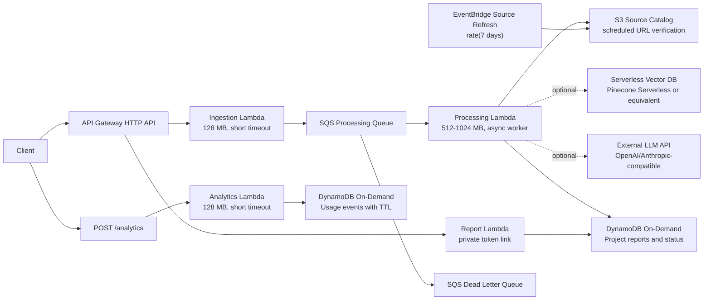

# GrantStack Backend Architecture Blueprint

GrantStack uses a fully asynchronous, decoupled serverless workflow designed for near-zero idle cost. The system avoids provisioned compute, persistent workers, NAT gateways, always-on databases, and fixed-capacity queues.

## Request Flow

1. A client submits project specifications to `POST /projects` on an Amazon API Gateway HTTP API.
2. API Gateway invokes the Ingestion Lambda through a Lambda proxy integration.
3. The Ingestion Lambda validates the payload, generates a `project_id` and private `access_token`, writes an accepted project record, sends the work item to SQS, and returns `202 Accepted` immediately.
4. SQS invokes the Processing Lambda asynchronously with `batch_size = 1`.
5. The Processing Lambda marks the project as `PROCESSING`, retrieves source-backed incentive context from the active S3 catalog and optional external vector source, evaluates jurisdiction-specific eligibility rules, assembles an LLM-ready prompt, writes the final cited report to DynamoDB, and sets status to `COMPLETED`.
6. The Report Lambda serves `GET /projects/{project_id}?token=...` for private report links.
7. Failures are retried by SQS. Poison messages move to the DLQ after the configured receive count.
8. A scheduled Source Refresh Lambda verifies official source URLs, records retrieval status and content hashes, and writes the active catalog to S3.
9. The frontend posts privacy-light product events to `POST /analytics`; the Analytics Lambda validates and stores them in a separate on-demand DynamoDB table with TTL.



## Near-Zero Idle Cost Controls

- API Gateway HTTP API has no provisioned gateway capacity.
- Lambda uses no provisioned concurrency and is not attached to a VPC, avoiding NAT gateway idle cost.
- SQS charges per request and stores messages only while work exists.
- DynamoDB uses `PAY_PER_REQUEST`; there is no provisioned read/write capacity.
- The analytics table also uses `PAY_PER_REQUEST` and TTL, preserving the same zero-idle compute posture for product telemetry.
- CloudWatch log groups use explicit retention.
- API Gateway throttling reduces accidental or abusive request bursts.
- DynamoDB TTL can expire pilot project records through `expires_at`.
- The source catalog uses S3 with lifecycle controls for old object versions.
- Remote Terraform state uses an encrypted S3 bucket with versioning and Terraform S3 lockfile support.
- External dependencies should use serverless or usage-based tiers.
- CloudWatch alarms are optional through `enable_cloudwatch_alarms`; disable them in throwaway environments if strict cost minimization matters more than monitoring.

Idle cost is not mathematically zero because durable storage, retained logs, CloudWatch dashboards/alarms, X-Ray traces, remote state, and stored queue messages can have storage charges, but there is no always-on compute or fixed-capacity infrastructure in the request path.

## Environments And Remote State

The main Terraform stack uses an S3 backend configured at init time:

- `terraform/backend/dev.hcl` stores state at `grantstack/dev/terraform.tfstate`.
- `terraform/backend/staging.hcl` stores state at `grantstack/staging/terraform.tfstate`.
- `terraform/backend/prod.hcl` stores state at `grantstack/prod/terraform.tfstate`.

Create the shared state bucket once:

```bash
terraform -chdir=terraform/bootstrap-state init
terraform -chdir=terraform/bootstrap-state apply
```

Initialize a target environment:

```bash
cp terraform/terraform.tfvars.example terraform/terraform.tfvars
terraform -chdir=terraform init -backend-config=backend/dev.hcl
terraform -chdir=terraform plan
```

Use `-reconfigure` when switching between backend configs:

```bash
cp terraform/env/staging.tfvars.example terraform/env/staging.tfvars
terraform -chdir=terraform init -reconfigure -backend-config=backend/staging.hcl
terraform -chdir=terraform plan -var-file=env/staging.tfvars
```

The included `env/*.tfvars.example` files define separate CORS, auth, retention, throttling, observability, and provider settings per environment. Staging and prod examples enable JWT auth and external LLM/vector calls by default.

## API Contract

`POST /projects`

Required JSON fields:

- `location`: non-empty string.
- `capex`: positive number.
- `jobs`: non-negative integer.
- `facility_type`: non-empty string.

Accepted optional fields:

- `metadata`: JSON object.
- `request_id`: non-empty string.
- `contact_email`: valid email string.
- `company_name`, `project_timeline`, `competing_locations`, `site_control`: bounded text fields.
- `average_wage`: positive number.

Successful response:

```json
{
  "project_id": "uuid",
  "access_token": "private-token",
  "status": "ACCEPTED"
}
```

`GET /projects/{project_id}?token={access_token}` returns the private status/report view. Missing tokens return `401`; invalid tokens return `403`.

`POST /analytics` records basic first-party events from the frontend:

- `event_name`: lowercase event name such as `page_view`, `cta_click`, `form_submit_success`, or `report_download_json`.
- `page_path`, `page_title`, `referrer`, and `session_id`: optional bounded strings.
- `properties`: bounded JSON object for low-cardinality product context.

Analytics is intentionally not part of the project-advice record. It is used for activation, conversion, and product-quality signals.

## DynamoDB Data Model

Table key:

- Partition key: `project_id` string.

Core attributes:

- `access_token`: private report-link token.
- `status`: `ACCEPTED`, `PROCESSING`, `COMPLETED`, `FAILED`, or `QUEUE_FAILED`.
- `input_spec`: validated client payload.
- `analysis_report`: final structured grant analysis.
- `vector_matches`: source-backed context used for the analysis.
- `llm_metadata`: provider/model metadata.
- `attempt_count`: SQS processing attempts.
- `expires_at`: DynamoDB TTL epoch value.
- `created_at`, `updated_at`, `completed_at`, `failed_at`: ISO-8601 timestamps.

The processor is idempotent at the project level because all writes target the same `project_id`.

Analytics table key:

- Partition key: `event_id` string.

Core analytics attributes:

- `event_name`: validated frontend event name.
- `page_path`, `page_title`, `referrer`, `session_id`: bounded context fields.
- `properties`: sanitized bounded JSON object.
- `received_at`: ISO-8601 ingestion timestamp.
- `expires_at`: DynamoDB TTL epoch value.

## Security Model

- Ingestion Lambda can only write to the processing SQS queue, create/update project records, and write its own CloudWatch logs.
- Processing Lambda can only poll/delete from the processing SQS queue, write to the DynamoDB projects table, and write its own CloudWatch logs.
- Report Lambda can only read project records and write its own CloudWatch logs.
- Analytics Lambda can only put items into the analytics DynamoDB table and write its own CloudWatch logs.
- Source Refresh Lambda can only read/write the configured S3 catalog object and write its own CloudWatch logs.
- Lambdas can write X-Ray traces only when `enable_xray_tracing = true`.
- SQS queues use AWS-managed server-side encryption.
- DynamoDB uses server-side encryption.
- Source catalog and remote state buckets use S3 server-side encryption and block public access.
- No secrets are hardcoded. The Terraform module accepts Secrets Manager ARNs, not secret values.
- External provider keys should live in AWS Secrets Manager. Terraform accepts only secret ARNs and grants the processor Lambda `secretsmanager:GetSecretValue` for those configured ARNs.
- `POST /projects` can be protected with an API Gateway JWT authorizer by setting `jwt_authorizer.enabled = true` with a trusted issuer and audience.

## AI And Retrieval Modes

GrantStack supports two processor modes:

- `mock_external_calls = true`: deterministic source-backed report generation. This is the deployed dev cost-control mode and requires no paid vector or LLM provider.
- `mock_external_calls = false`: production provider mode. The processor builds an OpenAI-compatible embedding, queries Pinecone Serverless or a compatible JSON vector endpoint, evaluates eligibility rules against the retrieved programs, then calls OpenAI, Anthropic, or a generic JSON LLM endpoint.

The deterministic report remains the guardrail in provider mode. External LLM output is merged into the source-backed baseline, and recommended programs must preserve source URLs from retrieved context.

The embedded corpus includes curated industrial incentive sources for GA, NC, SC, TN, TX, OH, IN, AL, KY, and federal EDA programs. Each supported program can have explicit rules in `lambda/eligibility_rules.json`. Rule results are stored in `analysis_report.rule_summary` and `analysis_report.eligibility_checks` so a report can show pass/fail/unknown checks before any paid advisory use.

Provider variables:

- `vector_db_provider`: `pinecone` or `generic_json`.
- `vector_db_endpoint` and `vector_db_api_key_secret_arn`.
- `vector_db_namespace`, `vector_db_top_k`, `vector_db_min_score`, and optional `vector_db_api_version`.
- `embedding_provider = "openai"`, `embedding_api_endpoint`, `embedding_api_key_secret_arn`, and `embedding_model`.
- `llm_provider`: `openai`, `anthropic`, or `generic_json`.
- `llm_api_endpoint`, `llm_api_key_secret_arn`, and `llm_model`.

Secrets Manager values may be raw strings or JSON objects containing `api_key`, `token`, `value`, or `secret`.

### Vector Index Sync

The curated corpus is embedded and upserted separately from Terraform so provider activation does not require baking secrets into infrastructure code:

```bash
grantstack-backend/scripts/sync_vector_index.py --dry-run

OPENAI_API_KEY="..." \
PINECONE_API_KEY="..." \
PINECONE_INDEX_HOST="https://your-index-host.svc.aped-4627-b74a.pinecone.io" \
PINECONE_NAMESPACE="grantstack-incentives-staging" \
grantstack-backend/scripts/sync_vector_index.py
```

The script reads `lambda/incentive_catalog.json` and `lambda/eligibility_rules.json`, creates one retrieval document per program, calls the OpenAI embeddings endpoint, and upserts vectors with metadata to the configured Pinecone namespace. The Lambda provider path queries the same namespace through `VECTOR_DB_NAMESPACE`.

## Source Refresh Pipeline

When `enable_source_refresh = true`, Terraform creates:

- Versioned, encrypted, private S3 bucket for the active source catalog.
- Source Refresh Lambda packaged with the curated local catalog.
- EventBridge schedule using `source_refresh_schedule_expression`, defaulting to `rate(7 days)`.
- Least-privilege IAM for the refresh Lambda to read/write only the configured catalog object.

The refresh job loads the local curated catalog as authoritative program metadata, merges previous retrieval status fields from S3, verifies each official source URL over HTTPS, records HTTP status and content SHA-256, and writes the refreshed catalog back to S3. The processor reads the S3 catalog first and falls back to the embedded catalog if S3 is unavailable.

## Observability

The stack includes a production baseline without always-on compute:

- Active X-Ray tracing on all Lambdas when `enable_xray_tracing = true`.
- Structured API Gateway access logs controlled by `enable_api_access_logs`.
- CloudWatch dashboard controlled by `enable_cloudwatch_dashboard`; output `cloudwatch_dashboard_name`.
- Lambda error alarms for ingestion, processor, report, analytics, and source refresh.
- Processor failure metric filter for `project_processing_failed` log lines.
- SQS queue-age alarm and DLQ visible-message alarm.

Dashboard widgets cover API traffic/errors/latency, Lambda errors and p95 duration, SQS/DLQ health, project and analytics DynamoDB on-demand activity, and source refresh health.

## Failure Handling

- The processor uses SQS partial batch failure responses.
- `batch_size = 1` isolates project failures and avoids cross-message replay.
- Transient vector DB or LLM failures raise an exception so SQS retries the message.
- After `dlq_max_receive_count`, the message is moved to the DLQ for inspection and replay.
- Failed attempts update DynamoDB status to `FAILED` with a sanitized error message before being retried.

## Deployment Notes

From `grantstack-backend/terraform`:

```bash
cp terraform.tfvars.example terraform.tfvars
terraform init -backend-config=backend/dev.hcl
terraform plan
terraform apply
```

The Terraform uses the `archive` provider to package the Python handlers from `../lambda`, so no manual zip step is required.

## Smoke Test

After deployment:

```bash
python ../scripts/smoke_test.py
```

If JWT auth is enabled, provide a valid token:

```bash
GRANTSTACK_AUTH_TOKEN="eyJ..." python ../scripts/smoke_test.py
```

The smoke test posts a sample project, polls the public private-report endpoint until `COMPLETED`, verifies cited recommendations, and verifies the DLQ is empty.

## CI

The repository includes a GitHub Actions workflow at `.github/workflows/validate.yml` that runs:

- `terraform fmt -check`
- `terraform init -backend=false`
- `terraform validate`
- Python bytecode compilation and focused handler tests

## DLQ Replay

Use `docs/DLQ_REPLAY_RUNBOOK.md` when the DLQ alarm fires. The runbook covers inspection, root-cause repair, native SQS redrive, and post-replay verification.
